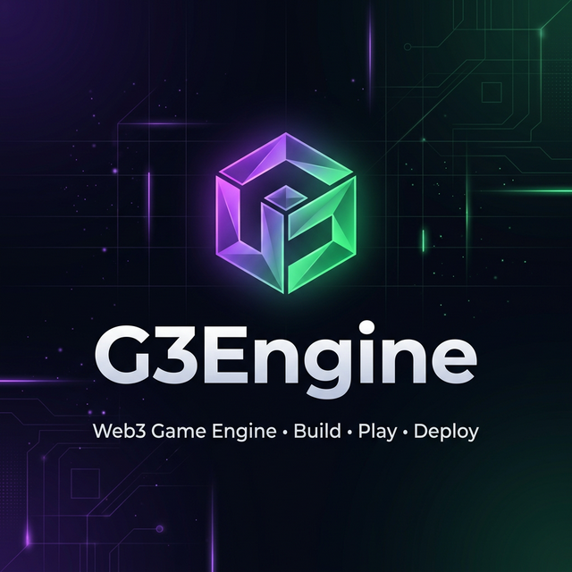

<p align="center">
  
</p>

<h1 align="center">G3Engine</h1>

<p align="center">
  <strong>The Web3-Native Game Engine — Build, Play, Deploy.</strong>
</p>

<p align="center">
  <a href="#features"></a>
  <a href="#web3"></a>
  <a href="#getting-started"></a>
  <a href="#license"></a>
</p>

<p align="center">
  Build interactive <b>2D & 3D games</b> entirely in the browser.<br/>
  Drag-and-drop objects, wire logic with visual scripting, integrate <b>Solana Web3</b> utilities,<br/>
  and one-click deploy to the web, Telegram, or Twitter/X.
</p>

---

## ✨ Features

### 🎮 Dual Editor — 2D & 3D
| Feature | Description |
|---|---|
| **3D Editor** | Full Three.js-powered viewport with real-time rendering, orbit controls, and transform gizmos |
| **2D Editor** | Sprite-based canvas editor with layers, drag & drop, and tile-friendly tooling |
| **Scene Graph** | Hierarchical object tree with visibility toggles, renaming, and deletion |
| **Inspector Panel** | Real-time editing of Position, Rotation, Scale, Material (color, roughness, metalness, emissive) |
| **Asset Library** | One-click primitives: Cube, Sphere, Cylinder, Plane, Cone, Torus, Lights, Camera |

### 🧩 Visual Scripting (Node Editor)
- **Blueprint-style** node graph built on `@xyflow/react`
- Connect logic nodes visually — no code required
- Event triggers, conditions, actions, and game loops
- Compile node graphs into executable game scripts

### ⛓️ Web3 Integration (Solana)
| Module | What It Does |
|---|---|
| **Wallet Connect** | Phantom / Solflare via `@solana/wallet-adapter` |
| **Token Launcher** | Launch tokens on **Pump.fun** directly from the engine |
| **NFT Minting** | Mint in-game assets as Solana NFTs via Metaplex |
| **Token Gating** | Gate game content behind token/NFT ownership |
| **Airdrop Tool** | Airdrop tokens to players from within the editor |

### 🤖 AI Assistant
- Built-in **AI chat panel** powered by your API key
- Understands the entire engine — helps you build games with natural language
- Can generate scenes, suggest logic, and explain features

### 🚀 One-Click Publishing
- **Web** — Instant shareable URL
- **Telegram Mini App** — Deploy as a Telegram game bot
- **Twitter/X Player Card** — Embed playable games in tweets

### 📋 Starter Templates
Pre-built templates to jumpstart development:

| Template | Type | Description |
|---|---|---|
| Blank Canvas | 2D / 3D | Empty scene, full creative freedom |
| Platformer Starter | 2D / 3D | Ground, player, platforms, and collectibles |
| Token Gate Room | 3D | NFT-gated 3D space with glowing chest |
| NFT Gallery | 2D / 3D | Showcase digital art in an immersive space |
| Multiplayer Arena | 3D | Competitive arena with obstacles |
| Endless Runner | 2D | Auto-scrolling runner template |

### 🧭 Guided Onboarding Tour
- Auto-starts for first-time users
- 6-step interactive walkthrough of all editor controls
- Restartable anytime via the 🧭 Tour button

---

## 🏗️ Tech Stack

| Layer | Technology |
|---|---|
| **Framework** | Next.js 16 (App Router, Turbopack) |
| **3D Rendering** | Three.js + React Three Fiber + Drei |
| **2D Canvas** | Custom HTML5 Canvas renderer |
| **State** | Zustand |
| **Visual Scripting** | @xyflow/react (React Flow) |
| **Web3** | @solana/web3.js, Wallet Adapter, Metaplex |
| **Onboarding** | react-joyride |
| **Icons** | Custom Lucide SVG components (Iconify) |
| **Language** | TypeScript |

---

## 🚀 Getting Started

### Prerequisites

- **Node.js** ≥ 18.x
- **npm** ≥ 9.x
- A modern browser (Chrome, Firefox, Edge, Safari)

### Installation

```bash
# 1. Clone the repository
git clone https://github.com/harshitsiwach/g3engine.git
cd g3engine

# 2. Install dependencies
cd app
npm install

# 3. Start the development server
npm run dev
```

The app will be available at **http://localhost:3000**.

### Environment Variables (Optional)

Create a `.env.local` file inside the `app/` directory for optional API integrations:

```env
# AI Assistant (OpenAI-compatible)
OPENAI_API_KEY=your_openai_api_key

# Solana RPC (defaults to devnet)
NEXT_PUBLIC_SOLANA_RPC_URL=https://api.devnet.solana.com
```

### Build for Production

```bash
cd app
npm run build
npm start
```

---

## 📁 Project Structure

```
g3engine/
├── app/                          # Next.js application
│   ├── src/
│   │   ├── app/                  # Pages (Home, New Project, Editor, Editor-2D, Play)
│   │   ├── components/
│   │   │   ├── ai/               # AI Chat Panel
│   │   │   ├── editor/           # 3D Editor components (Viewport, AssetLibrary, Tour)
│   │   │   ├── editor-2d/        # 2D Editor components
│   │   │   ├── icons/            # Premium SVG icon library
│   │   │   ├── layout/           # TopBar, LeftPanel, RightPanel, BottomPanel
│   │   │   ├── scripting/        # Visual Node Editor
│   │   │   └── web3/             # Web3Panel, MintNFT, TokenLauncher, Airdrop
│   │   ├── lib/                  # Core engine logic
│   │   │   ├── gameGenerator.ts  # Command-based scene generator
│   │   │   ├── templates.ts      # Genre starter templates
│   │   │   ├── scriptCompiler.ts # Node graph → script compiler
│   │   │   ├── sceneSerializer.ts# Scene export/import
│   │   │   └── web3Runtime.ts    # Solana runtime utilities
│   │   ├── store/                # Zustand state stores
│   │   │   ├── editorStore.ts    # 3D editor state
│   │   │   ├── editor2DStore.ts  # 2D editor state
│   │   │   ├── projectStore.ts   # Project configuration
│   │   │   ├── web3Store.ts      # Web3/wallet state
│   │   │   └── aiStore.ts        # AI assistant state
│   │   └── providers/            # React context providers
│   └── public/                   # Static assets
└── README.md
```

---

## 🎮 Usage Guide

### Creating a New Project
1. Visit the **home page** and click **"Start Creating"**
2. Choose your dimension: **2D** or **3D**
3. Pick a **genre** (Platformer, RPG, Racing, etc.)
4. Select a **starter template** or start from scratch
5. Name your project and enter the editor

### Building Your Game
- **Add Objects**: Click primitives in the **Asset Library** (bottom panel)
- **Transform**: Use **Position (W)**, **Rotation (E)**, **Scale (R)** tools
- **Inspect**: Select any object to edit properties in the **Inspector** (right panel)
- **Script**: Switch to the **Logic** tab for visual node-based scripting
- **Play**: Hit the **▶ Play** button to test in real-time

### Adding Web3
1. Toggle **Web3** in the TopBar
2. Connect your **Solana wallet** (Phantom / Solflare)
3. Use the Web3 panel to:
   - Launch a token on **Pump.fun**
   - Mint in-game assets as **NFTs**
   - Set up **token gating**
   - Configure **airdrops**

### Publishing
Click **Publish** → choose your platform → deploy instantly.

---

## 🤝 Contributing

We welcome contributions! Here's how:

1. **Fork** the repository
2. **Create** a feature branch (`git checkout -b feature/amazing-feature`)
3. **Commit** your changes (`git commit -m 'Add amazing feature'`)
4. **Push** to the branch (`git push origin feature/amazing-feature`)
5. Open a **Pull Request**

---

## 📄 License

This project is licensed under the **MIT License** — see the [LICENSE](LICENSE) file for details.

---

## 🔗 Links

- **Website**: Coming Soon
- **Twitter/X**: [@g3engine](https://twitter.com/g3engine)
- **Discord**: Coming Soon

---

<p align="center">
  <sub>Built with ❤️ using Next.js, Three.js, and Solana</sub>
</p>
